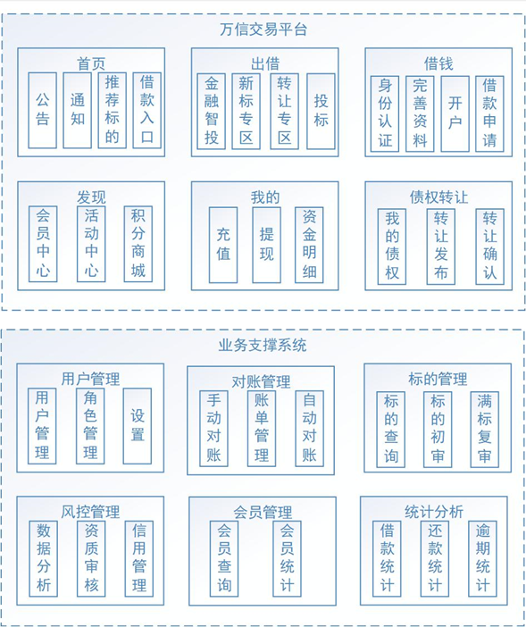
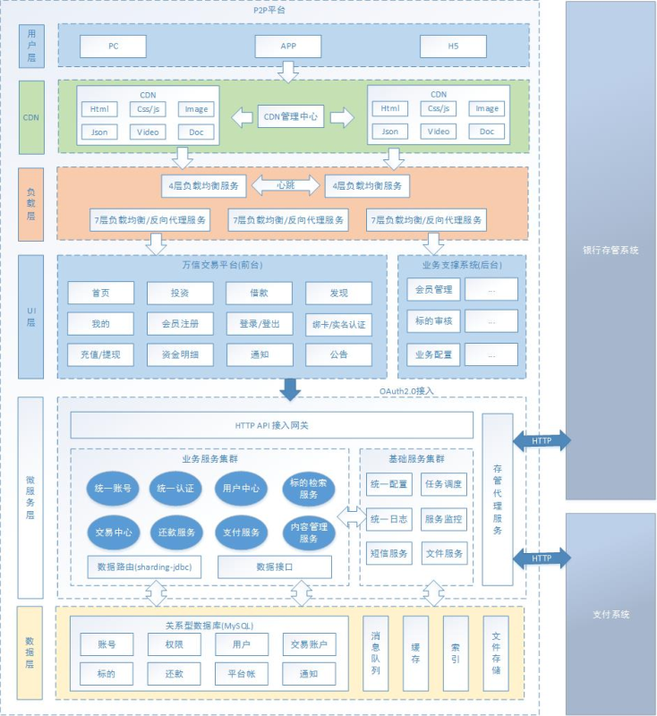

<div align="center">


# 📊 万信金融P2P平台  
**互联网金融解决方案 | 提供理财、借贷、风控及银行存管一体化服务**

  <!-- 前端 -->
    
    
    

  <!-- 后端 -->
    
    
    

  <!-- 中间件 -->
    
    
    

  <!-- 数据库 -->
    
    
</div>


## 📌 项目简介  
**万信金融** 是一款面向互联网大众的金融平台，提供 **P2P理财服务** 和 **个人消费信贷服务**，依托大数据风控技术，实现安全、快捷、稳定的金融服务。  
系统核心价值：  
- **业务闭环**：覆盖借贷、出借、风控、对账全流程  
- **技术先进**：微服务架构 + 分布式事务保障高并发  
- **合规性**：银行存管系统对接，符合金融监管要求  

### 🎯 核心功能  
- **理财服务**：出借、标的管理、收益统计  
- **借贷服务**：借款申请、风控审核、还款计划  
- **风控体系**：身份认证（百度AI）、信用评估、逾期预警  
- **安全交易**：HTTPS加密 + SHA1withRSA签名  

---

## 🧩 功能模块  
### 业务模块全景  
  
**核心模块**：  
1. **交易平台**：用户出借、借款、标的管理  
2. **风控管理**：身份认证、征信评估、风险控制  
3. **对账系统**：银行存管数据同步与差异校验  

---

## 📐 技术架构  
### 系统架构全景  
  
**核心设计原则**：  
- **微服务化**：基于Spring Cloud Alibaba拆分为8大服务  
- **数据分层**：OLTP（MySQL）与OLAP（Sharding-JDBC）分离  
- **高可用性**：Apollo配置中心 + Elastic-job任务调度  

### 技术栈全景  
| 层级         | 技术选型                                                                 |
|--------------|--------------------------------------------------------------------------|
| **前端**     | Vue + Element UI + ECharts                                              |
| **网关层**   | Spring Cloud Gateway + Zuul                                               |
| **服务层**   | Spring Boot 2.7 + MyBatis Plus + MapStruct                              |
| **消息队列** | RocketMQ 4.9                                                            |
| **数据层**   | MySQL 5.6+ + Redis 6.2 + Sharding-JDBC                                  |
| **中间件**   | Apollo配置中心 + Elastic-job任务调度                                    |
| **安全**     | Spring Security OAuth2 + JWT + HTTPS                                    |

---

## 🧱 核心服务与端口  
| 服务名称                          | 端口      | 功能描述                                                                 |
|----------------------------------|-----------|--------------------------------------------------------------------------|
| 注册与发现 (wanxinp2p-discover-server) | 53000    | 服务注册与发现                                                            |
| 网关 (wanxinp2p-gateway-server)       | 53010    | API路由、限流熔断                                                         |
| UAA认证 (wanxinp2p-uaa-service)       | 53020    | 统一身份认证与权限管理                                                    |
| 统一账号服务 (wanxinp2p-account-service) | 53030 | 用户账户管理                                                              |
| 交易中心服务 (wanxinp2p-transaction-service) | 53060 | 订单生成、交易状态同步                                                    |
| 存管代理服务 (wanxinp2p-depository-agent-service) | 53070 | 银行存管数据交互                                                          |
| 还款服务 (wanxinp2p-repayment-service) | 53080   | 还款计划计算与执行                                                        |

---

## 💾 数据库设计  
| 数据库名                      | 数据量级     | 核心表设计                                                                 |
|-------------------------------|--------------|----------------------------------------------------------------------------|
| `p2p_account`                 | 500万+       | 用户账户表（含余额、信用等级、绑定银行卡）                                  |
| `p2p_transaction_0/1`         | 1亿+         | 交易记录表（按月份分表，Sharding-JDBC实现）                                 |
| `p2p_repayment`               | 实时写入     | 还款计划表（逾期状态跟踪）                                                  |
| `p2p_bank_depository`         | 金融级       | 银行存管数据（资金流水、对账记录）                                          |

---

## 🧰 技术解决方案  
### 核心技术亮点  
| 技术领域                | 解决方案                                                                 |
|-------------------------|--------------------------------------------------------------------------|
| **微服务架构**          | Spring Cloud Alibaba + Nacos服务注册与发现                                |
| **接口规范**            | Spring Boot + Swagger自动生成API文档                                     |
| **分布式事务**          | RocketMQ事务消息 + Hmily框架 + requestNo同步机制                         |
| **分库分表**            | Sharding-JDBC实现交易数据水平拆分                                        |
| **任务调度**            | Elastic-job定时对账、还款任务执行                                        |
| **安全交易**            | HTTPS + SHA1withRSA签名 + 百度AI身份认证                                  |

---

## 📦 部署指南  
### 快速部署步骤  
```bash
# 1. 导入数据库
mysql -u root -p -e "source wanxinp2p-init.sql"
mysql -u root -p -e "source wanxindepository-init.sql"

# 2. 搭建中间件（Apollo配置中心）
docker run -d -p 8080:8080 apollo-configservice

# 3. 编译工程
mvn clean install -Denv=dev -Dapollo.cluster=DEFAULT -Dserver.port=53010

# 4. 启动核心服务
java -jar wanxinp2p-gateway-server.jar
```

### 演示地址  
- **在线体验**：[P2P平台管理端](http://wanxinp2p-admin-java.itheima.net/)  
- **前端工程**：[万信金融门户](https://gitee.com/itxinfei/wanxinp2p-portal)  

---

## 📝 注意事项  
1. **部署依赖**：  
   - 需安装JDK1.8+、Maven3.6.3+、Docker  
   - 中间件依赖：Apollo、RocketMQ、Sharding-JDBC  

2. **日志排查**：  
   - 日志目录：`logs/wanxinp2p/*.log`  
   - 关键指标监控：`/actuator/prometheus`  

---

### 🔗 项目链接 & 社区支持  
  
🚀 项目地址：[https://gitee.com/itxinfei/wanxinp2p](https://gitee.com/itxinfei/wanxinp2p)  
👥 QQ交流群：[661543188](https://qm.qq.com/cgi-bin/qm/qr?k=gNgch-wCkfUu-QbI7DZSudrax2BN7vY0&jump_from=webapi&authKey=QHSRnxQvu+h5S3AXGn/DSHrVPiFQAYEk6bSlCE1lS276SFjQAUagV4FG7bHf0OSM)  
📧 邮箱支持：[747011882@qq.com](http://mail.qq.com/cgi-bin/qm_share?t=qm_mailme&email=f0hLSE9OTkdHTT8ODlEcEBI)  
*


