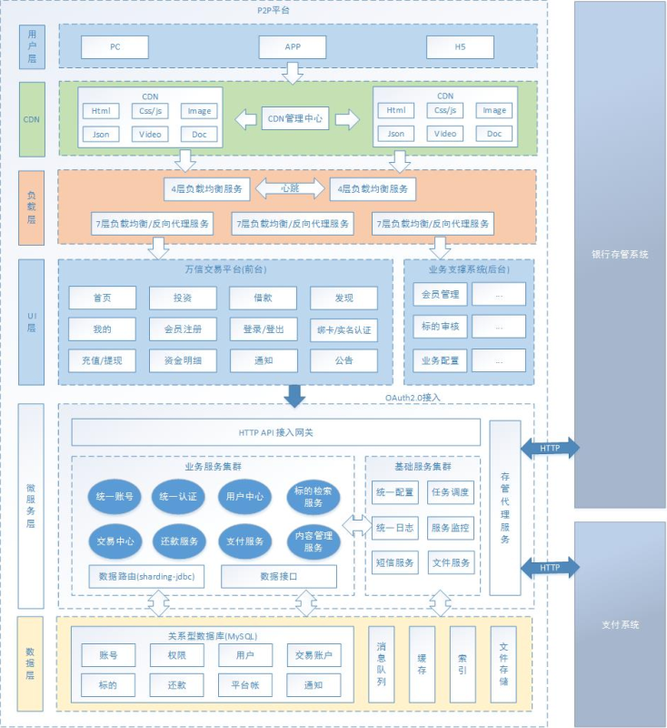

   
   
   
   
  
   

#### 一、项目背景
P2P金融又叫P2P信贷，P2P是 peer-to-peer 或 person-to-person 的简写，意思是个人对个人，P2P金融是指个人与个人间的小额借贷交易，一般需要借助电子商务专业网络平台帮助借贷双方确立借贷关系并完成相关交易手续。

目前，国家对P2P行业的监控与规范性控制越来越严格，出台了很多政策来对其专项整治，P2P平台之前所采用的“资金池模式”与“第三方支付托管”（见下文定义）已经不合规了，国家主张采用“银行存管模式”来规避P2P平台挪用借投人资金的风险，通过银行开发的“银行存管系统”管理投资者的资金，每位P2P平台用户在银行的存管系统内都会有一个独立账号，P2P平台来管理交易，做到资金和交易分开，让P2P平台不能接触到资金，就可以一定程度避免资金被挪用的风险。

- 什么是资金池模式？

此模式下，投资人利用第三方支付/银行的通道先把资金打到平台的银行账户，P2P的平台就池子一样，汇聚了投资人和借款人的资金，这个汇集资金的池子叫做资金池，是P2P平台方最容易跑路的模式。

- 什么是第三方支付托管模式？

此模式下，投资人/借款人除了要在P2P平台注册外，还要在第三方支付平台注册，也就是平台和第三方各有一套账户体系。经过第三方支付的资金托管后，由于资金沉淀发生在第三方支付在银行的备付金账户上，P2P平台运营方只能看到投资人/借款人账户余额的变化及债权匹配关系，不能像资金池那样擅自挪用投资人的钱，但是这里存在安全风险的是第三方支付机构。

- 什么是银行存管模式？

此种模式下，涉及到2套账户体系，P2P平台和银行各一套账户体系。投资人在P2P平台注册后，会同时跳转到银行再开一个电子账户，2个账户间有一一对应的关系。当投资人投资时，资金进入的是平台在银行为投资人开设的二级账户中，每一笔交易，是由银行在投资人与借款人间的交易划转，P2P平台仅能看到信息的流动。

#### 二、项目概述 
本次课程开发的万信金融是一款面向互联网大众提供的理财服务和个人消费信贷服务的金融平台，依托大数据风控技术，为用户提供方便、快捷、安心的P2P金融服务。本项目包括交易平台和业务支撑两个部分，交易平台主要实现理财服务，包括：借钱、出借等模块，业务支撑包括：标的管理、对账管理、风控管理等模块。项目采用先进的互联网技术进行研发，保证了P2P双方交易的安全性、快捷性及稳定性。

#### 三、功能模块

#### 四、技术架构图

#### 五、技术解决方案
|  主要的解决方案    |
| ---- |
|  1、微服务技术应用于P2P金融业务解决方案   |
| 2、接口规范SpringBoot+Swagger|
| 3、持久层编码 MyBatis Plus|
| 4、分布式系统配置中心：Apollo|
| 5、UAA认证方案：Spring Security Oauth2+JWT+ZUUL|
| 6、分布式事务解决方案（RocketMQ、Hmily、requestNo同步机制）|
| 7、分库分表解决方案：Sharding-jdbc|
| 8 、分布式任务调度方案：Elastic-job|
| 9、安全交易方案：HTTPS+SHA1withRSA|
| 10、身份认证方案：百度AI|
| 11、短信验证系统方案：短信验证服务+第三方短信平台（腾讯）|

#### 六、P2P平台服务
| 服务端口                                                 |
| -------------------------------------------------------- |
| 注册与发现 (wanxinp2p-discover-server)：53000            |
| 网关 wanxinp2p-gateway-server)：53010                    |
| uaa(wanxinp2p-uaa-service) ：53020                       |
| 统一账号服务 (wanxinp2p-account-service)：53030          |
| 用户中心服务 (wanxinp2p-consumer-service)：53050         |
| 交易中心服务 (wanxinp2p-transaction-service)：53060      |
| 存管代理服务 (wanxinp2p-depository-agent-service)：53070 |
| 还款服务 (wanxinp2p-repayment-service)：53080            |
| 文件服务 (wanxinp2p-file-service)：56082                 |
| 短信验证码服务 (sailing)：56085                          |
| P2P 平台前端(wanxinp2p_front)：8081                      |
| P2P 平台管理端后台(wanxinp2p-manager)：8079                                 |
| 银行存管系统：55010                                      |

| 数据库清单                                |
| ----------------------------------------- |
| p2p_uaa 统一认证数据                      |
| p2p_account 统一账户数据                  |
| p2p_consumer 用户中心数据                 |
| p2p_transaction_0 交易中心数据库1         |
| p2p_transaction_1 交易中心数据库2         |
| p2p_undo_log 分布式事务框架Hmily数据库    |
| p2p_repayment 还款中心数据                |
| p2p_file 文件存储服务                     |
| p2p_bank_depository 银行存管系统          |
| p2p_depository_agent 银行存管代理服务数据 |
| p2p_reconciliation 对账数据               |

#### 七、项目部署
##### 1、导入数据库
- 安装MySQL数据库(v5.6.5+)
- 执行wanxinp2p-init.sql 创建P2P平台数据库并导入初始数据
- 执行wanxindepository-init.sql 创建银行存管系统数据库并导入初始数据

##### 2、搭建中间件
Apollo安装和导入sql,添加配置文件。

##### 3、编译工程
添加vm参数，在application.yml文件头部。比如：-Denv=dev -Dapollo.cluster=DEFAULT -Dserver.port=53010

**注：以后有时间在整理文档，安装部署的注意事项吧。项目基本功能都写完了，有问题有需求可以在群（QQ群：863662849 ）里咨询，感谢！！！**